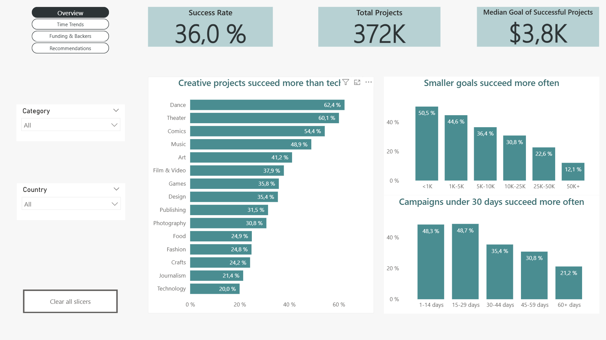
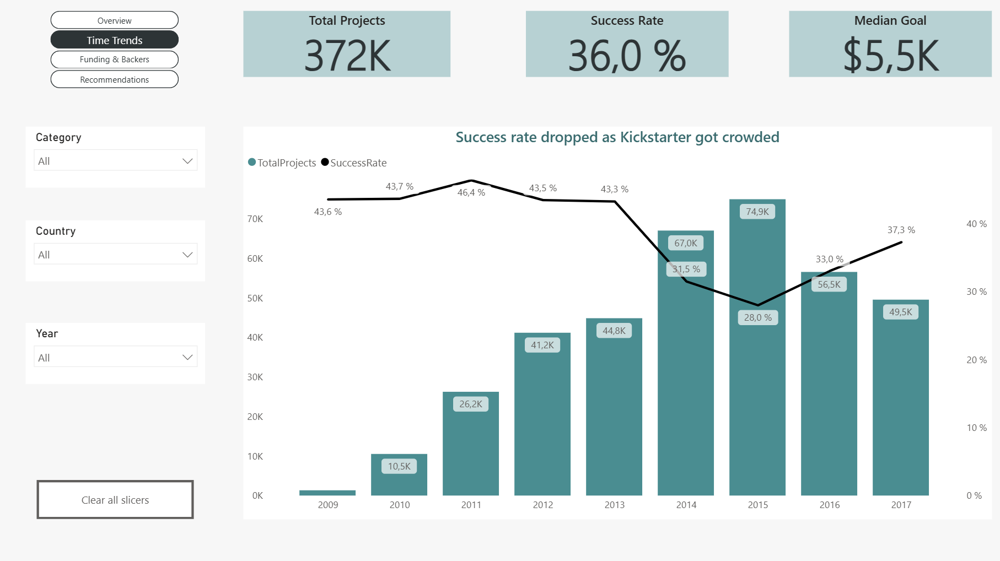
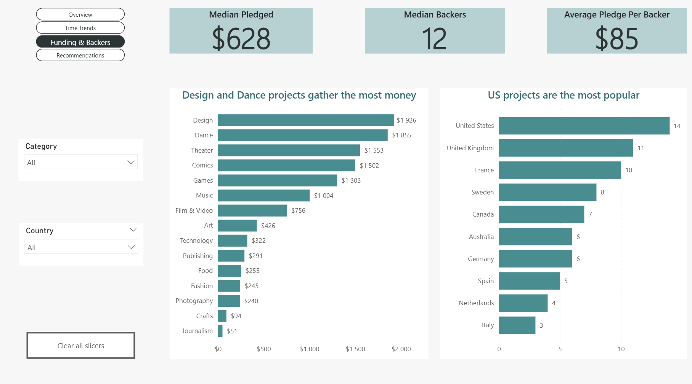
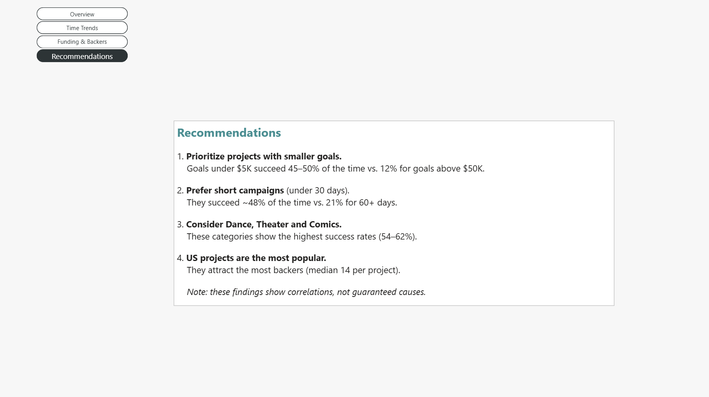

# Kickstarter Success Analysis

Power BI dashboard analyzing Kickstarter projects to find out what makes them successful.

## Business question

Which categories and types of projects succeed most often?

## Data

- 375K Kickstarter projects
- Live projects were excluded

## Key findings

- Projects with goals under $1K succeed 51% of the time, vs. 12% for goals above $50K.
- Campaigns under 30 days succeed ~48% of the time, vs. 21% for 60+ days.
- Dance, Theater and Comics sectors succeed 54–62% of the time; Technology and Journalism only ~20%.

## Dashboard

### Overview

### Time Trends

### Funding & Backers

### Recommendations

## Tools & techniques

- Power Query: data cleaning and filtering
- DAX: measures and calculated columns
- Combo charts, custom tooltips, page navigation

## Files

- `Kickstarter projects.pbix` — Power BI report file
